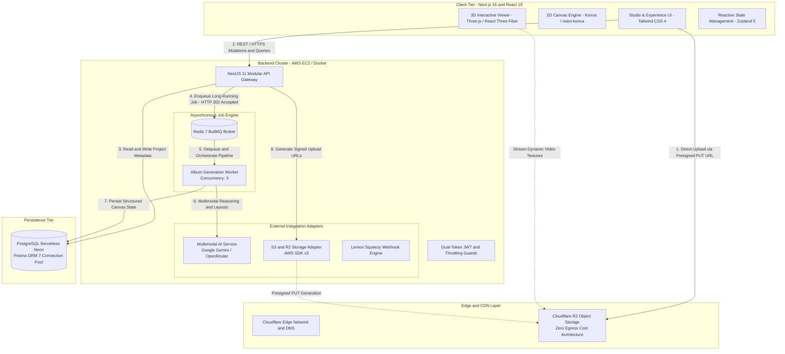

# Volio — Interactive 3D & Multimodal AI SaaS Platform

[](https://nextjs.org/)
[](https://nestjs.com/)
[](https://www.typescriptlang.org/)
[](https://threejs.org/)
[](https://docs.pmnd.rs/react-three-fiber)
[](https://bullmq.io/)
[](https://www.docker.com/)
[](https://aws.amazon.com/ec2/)
[-4169E1?style=for-the-badge&logo=postgresql&logoColor=white)](https://neon.tech/)
[](https://www.cloudflare.com/products/r2/)

---

## 📌 Repository Notice & Intellectual Property Protection
> [!NOTE]
> **Architecture & Systems Showcase:** This public repository is an architectural demonstration, system design deep dive, and technical showcase of the **Volio** platform. 
> To safeguard intellectual property, proprietary business algorithms, and commercial assets, private production keys, deployment secrets, environment variables (`.env`), and sensitive customer modules have been strictly omitted. The code patterns, Hexagonal ports, asynchronous workers, and custom WebGL hooks included here represent sanitized, production-grade architectural references.

---

## 🎯 Executive Summary

Traditional digital photo albums and online memory scrapbooks are static, fragmented, and disconnected from immersive modern web experiences. **Volio** is a next-generation SaaS platform engineered to transform personal and editorial memories into living, interactive digital artifacts. It seamlessly unites:
1. A desktop-grade **2D Studio Canvas Editor** with drag-and-drop layer hierarchy, snap guides, and typography controls.
2. A high-performance **3D WebGL Flip-Book Experience** capable of rendering real-time animated pages with dynamic video textures and spatial lighting at 60 FPS on mobile devices.
3. An automated **Multimodal AI Generation Pipeline** that translates raw user photos and conversational prompts into coherent visual layouts, narrative arcs, and curated color palettes.

### Engineering Leadership & Scope
- **Role:** Founder & Lead Full Stack Software Engineer (End-to-End Architecture & Full Stack Execution).
- **Scope:** Complete platform lifecycle — from domain modeling, Hexagonal NestJS backend, and asynchronous queue orchestration to React Three Fiber WebGL shaders, PostgreSQL persistence on Neon, and containerized AWS infrastructure.
- **Production Platform:** [volio-studio.com](https://volio-studio.com)
- **Live Interactive 3D Experience:** [Launch Interactive 3D Experience](https://volio-studio.com)

---

## 🏛️ High-Level System Architecture

The following diagram illustrates the end-to-end data flow, asynchronous decoupling, and cloud integration across Volio's client, gateway, worker, and storage layers:



---

## ⚡ Key Engineering Highlights

### 1. Asynchronous Job Processing & Distributed Worker Architecture
- **The Problem:** Multimodal LLM reasoning (Creative brief -> Asset collection -> Layout generation -> Deterministic canvas state calculation) takes between 15 and 45 seconds. Synchronous HTTP request cycles would trigger client/gateway timeouts (HTTP 504), tie up Node.js single-threaded event loops, and degrade system availability during usage bursts.
- **The Architectural Solution:** 
  - Decoupled ingestion via **BullMQ** backed by an in-memory **Redis 7** broker.
  - The API endpoint (`POST /ai-gen/album`) validates payloads using `class-validator`, creates a database draft with state `PENDING`, and immediately returns an HTTP `202 Accepted` response with `{ albumId, jobId }`.
  - The worker (`AlbumGenerationProcessor`) executes with a bounded concurrency of 3, orchestrating multi-stage pipeline checkpoints:
    1. `CREATIVE_BRIEF` (25%) — Generates narrative arcs and palette tokens.
    2. `LAYOUT_DESIGN` (60%) — Synthesizes spatial element arrangements.
    3. `CANVAS_COMPOSITION` (85%) — Runs deterministic conflict resolution and contrast checks.
    4. `COMPLETED` (100%) — Finalizes the album for client consumption.
  - Granular progress is saved to PostgreSQL and BullMQ progress counters, allowing the frontend client to display real-time animated stage trackers without WebSocket overhead.

```typescript
// Architectural Pattern: Immediate HTTP 202 Acknowledgment + Queue Dispatch
@Post('album')
@HttpCode(HttpStatus.ACCEPTED)
async enqueueAlbumGeneration(@Body() dto: GenerateAlbumDto): Promise<EnqueueJobResponse> {
  const draft = await this.projectRepository.createDraftForOwner(userId, {
    title: dto.title,
    format: dto.format,
    generationStatus: 'PENDING',
  });

  const job = await this.albumQueue.add('process-album', {
    userId,
    albumId: draft.id,
    input: dto,
  }, {
    attempts: 2,
    backoff: { type: 'exponential', delay: 3000 },
  });

  return { albumId: draft.id, jobId: job.id as string, status: 'PENDING' };
}
```

### 2. High-Performance 3D WebGL Rendering & Dynamic Video Textures
- **The Challenge:** Skeuomorphic 3D book simulation requires rendering double-sided curving page meshes in real time. Incorporating dynamic user videos onto 3D book pages routinely causes severe memory bus congestion when naive render loops re-upload entire canvas textures on every `requestAnimationFrame`, causing mobile GPUs to drop below 20 FPS.
- **The Architectural Solution:**
  - **`useDevicePerformance` Hook:** Dynamically benchmarks client GPU hardware via WebGL unmasked renderer strings (`useDetectGPU`). Dynamically scales Device Pixel Ratio (DPR) between 1.0 and 2.0, disables expensive cascade shadow maps on Tier-0/1 devices, and adjusts shadow resolution (512² up to 1024²) to preserve a locked 60 FPS.
  - **`usePageCanvasTexture` Hook:** Implements native browser `requestVideoFrameCallback` (RVFC) with an rAF fallback. A `dirty` flag marks canvas updates only when the video decoder yields an actual new frame, eliminating redundant GPU memory transfers:
    $$\text{GPU Texture Uploads} = \text{Decoded Video FPS } (24\text{--}30) \quad \text{vs} \quad \text{Three.js Loop } (60\text{--}120\text{ FPS})$$
  - **Frustum & Visibility Culling:** Pages not currently visible to the active camera detach frame callbacks and pause backing video elements.

### 3. Cloud Infrastructure & Zero-Egress Storage
- **Direct-to-Storage Presigned Uploads:** File uploads (high-resolution images, video loops, audio tracks) never pass through the application servers. The NestJS backend issues cryptographically signed S3 PUT URLs via `@aws-sdk/s3-request-presigner`, allowing the client to stream payloads directly to **Cloudflare R2**.
- **Zero Data Egress Fees:** By deploying Cloudflare R2 instead of traditional AWS S3, Volio eliminates the egress pricing model ($0.09/GB on standard cloud providers). This enables heavy 3D asset, audio, and video texture streaming without escalating data transfer costs.
- **Containerized Deployment on AWS EC2:** Packaged via a multi-stage Docker build on Alpine Linux. Bundles headless Chromium and TrueType fonts (`ttf-freefont`, `font-noto-emoji`) allowing server-side background canvas rasterization and thumbnail synthesis.

---

## ⚖️ Architectural Decisions & Trade-offs

| Decision | Chosen Solution | Alternative Evaluated | Technical Rationale & Trade-off |
| :--- | :--- | :--- | :--- |
| **Backend Architecture** | **Modular Hexagonal (Ports & Adapters)** | Monolithic MVC | Strict boundary separation between core domain rules, application use cases, and infrastructure adapters allows swapping cloud providers (e.g. Gemini to Claude, or R2 to S3) with zero impact on domain code. |
| **Long-Running Workflows** | **Redis + BullMQ Distributed Queue** | Synchronous HTTP / In-memory Promises | Guarantees job persistence across server restarts, provides exponential backoff retries, protects the Node.js event loop, and enables independent scaling of background workers. |
| **3D Graphics Engine** | **React Three Fiber (Three.js)** | Pure 2D DOM / CSS 3D transforms | CSS 3D lacks genuine lighting, shadow casting, normal maps, and dynamic video shader texturing. R3F provides declarative scene graph management with WebGL hardware acceleration. |
| **Object Storage** | **Cloudflare R2 (S3-Compatible)** | AWS S3 Standard | Complete elimination of data egress bandwidth fees for media-intensive 3D assets while preserving compatibility with AWS SDK v3 primitives. |
| **Relational Database** | **PostgreSQL on Neon (Serverless)** | Self-hosted PostgreSQL on EC2 | Neon provides instant autoscaling, compute branch isolation for staging environments, and high-performance connection pooling via Prisma ORM 7 without infrastructure maintenance overhead. |

---

## 📂 Codebase Showcase Structure

This repository provides sanitized architectural skeletons illustrating the patterns discussed above:

```
volio-showcase/
├── docs/                                 # Architectural specifications & design documents
│   ├── ARCHITECTURE.md
│   ├── SYSTEM_DESIGN.md
│   └── PERFORMANCE.md
├── src/
│   ├── backend/
│   │   ├── modules/
│   │   │   ├── ai-gen/                  # Hexagonal AI Generation Module
│   │   │   │   ├── application/         # DTOs & Use Cases (Multi-stage pipeline)
│   │   │   │   ├── domain/ports/        # Core ports (IAIProvider, IProjectRepository)
│   │   │   │   ├── infrastructure/
│   │   │   │   │   ├── controllers/     # HTTP Controller (202 Accepted pattern)
│   │   │   │   │   ├── providers/       # Gemini adapter (Structured Outputs)
│   │   │   │   │   └── queues/          # BullMQ Worker implementation
│   │   │   │   └── ai-gen.module.ts     # NestJS Module & DI Provider Factories
│   │   │   └── media/                   # Cloudflare R2 presigned storage adapter
│   │   └── devops/                      # Multi-stage Dockerfile & docker-compose-prod
│   └── frontend/
│       └── modules/
│           └── experience/              # Three.js / React Three Fiber subsystem
│               ├── components/          # R3F Canvas root & camera controls
│               └── hooks/               # useDevicePerformance & usePageCanvasTexture
└── README.md
```

---

## 👨‍💻 Author

**Nicolas Santiago Diaz Santos**  
*Full Stack Software Engineer | React • Next.js • Node.js • NestJS*  
Cali, Colombia  

- 🌐 **Live Product:** [volio-studio.com](https://volio-studio.com)
- 💼 **LinkedIn:** [linkedin.com/in/nicolassdiazs](https://www.linkedin.com/in/nicolassdiazs)
- 🚀 **Portfolio:** [nicolas3dportafolio.netlify.app](https://nicolas3dportafolio.netlify.app/)
- 📧 **Email:** [diazsantosnicolas10@gmail.com](mailto:diazsantosnicolas10@gmail.com)
- 🐙 **GitHub:** [github.com/Nicolas29Diaz2](https://github.com/Nicolas29Diaz2)

---

## 📄 License
This project is licensed under the MIT License — see the [LICENSE](LICENSE) file for details.
