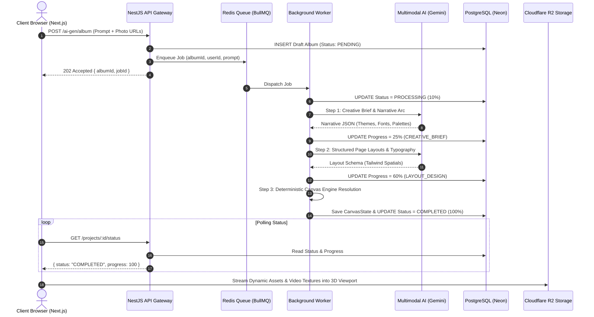

# Volio System Design Specification

## End-to-End Multimodal Pipeline Flow

The AI Album generation process operates across distributed system boundaries:

## Failure Recovery & State Isolation
- **Automatic Retries:** Jobs that encounter temporary rate limits or network partitions retry automatically with exponential backoff (delay: 3s).
- **Graceful Failure Tracking:** Failed jobs update database state to `FAILED` with sanitized error messages.
- **Rollback Safety:** If a brand-new generation job experiences an unrecoverable failure, empty draft entities are cleaned up to prevent orphaned records.
